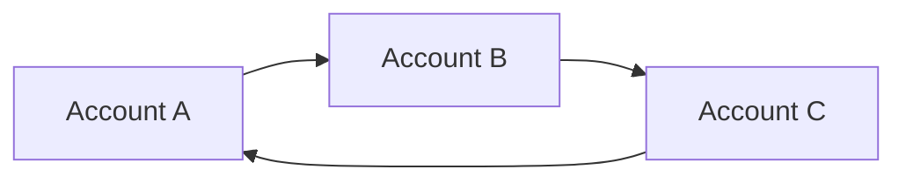
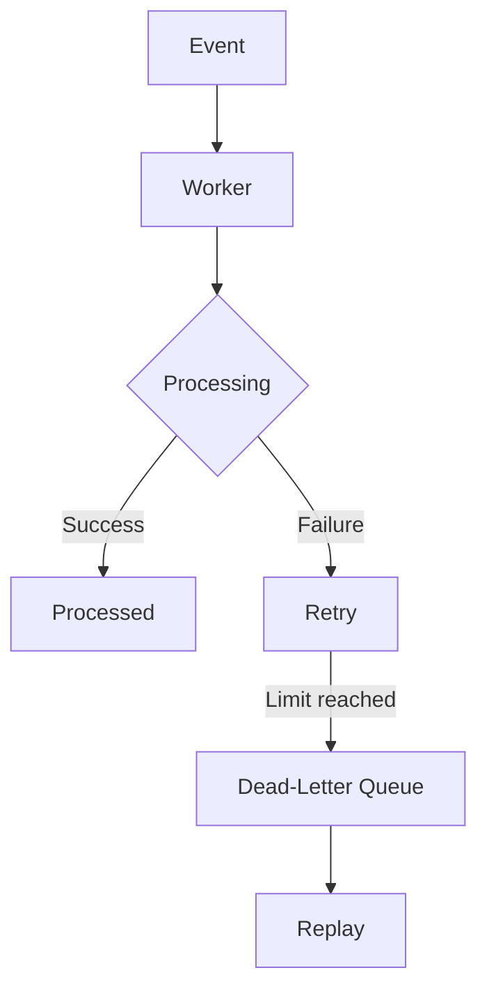
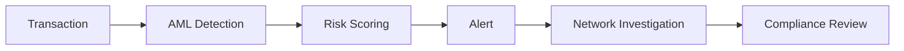
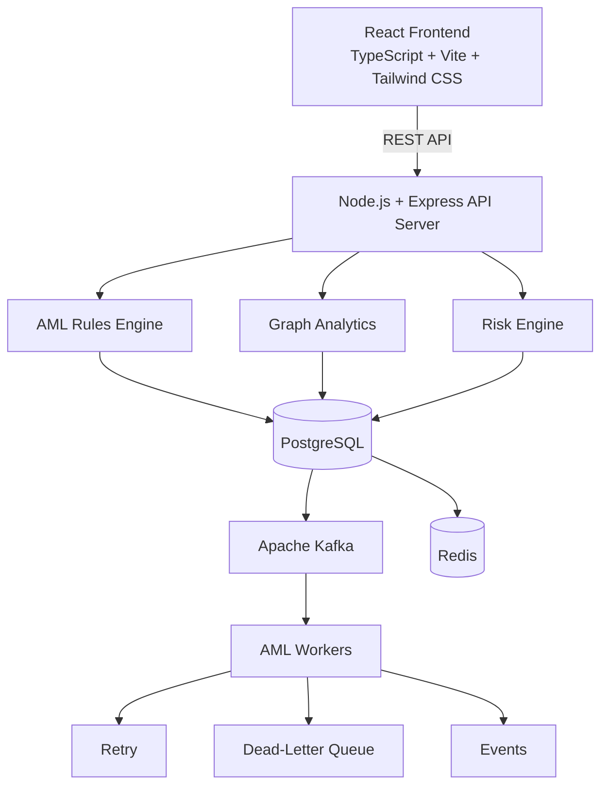
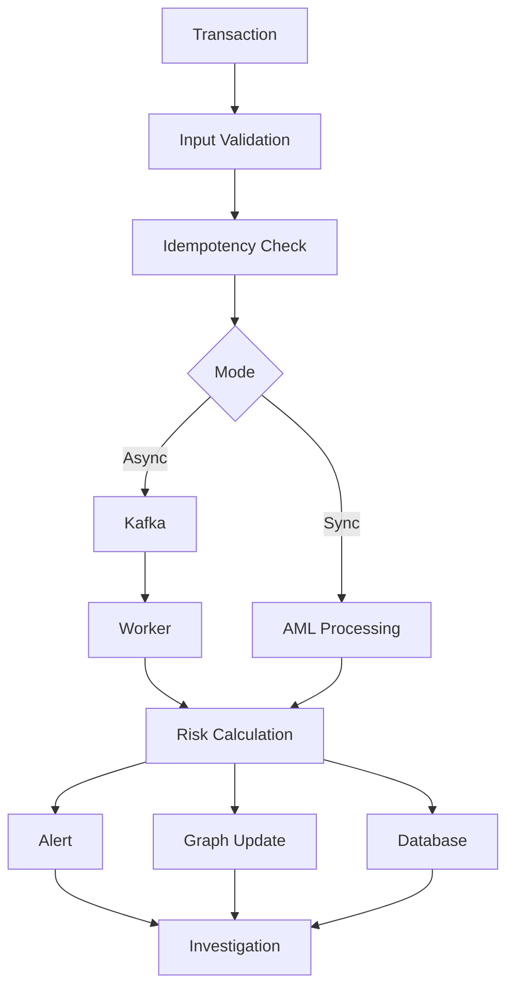
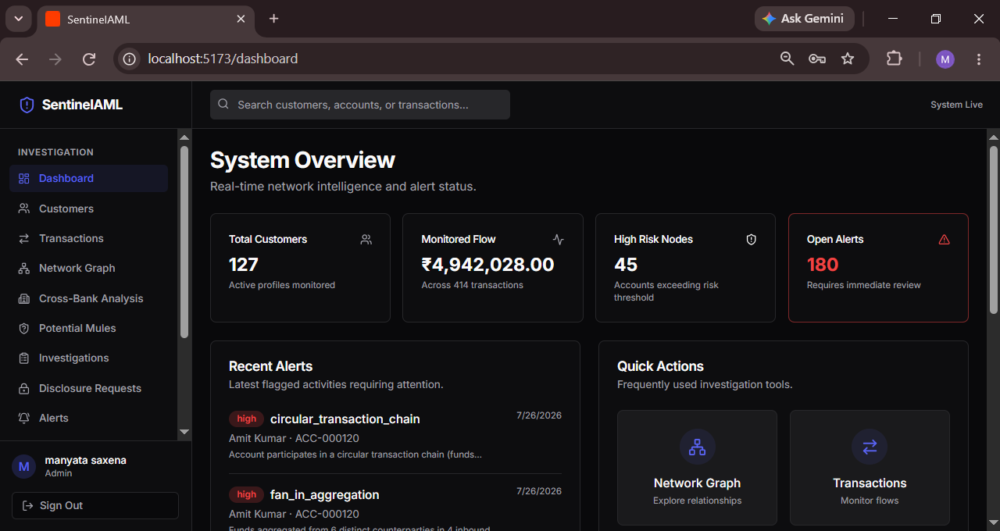
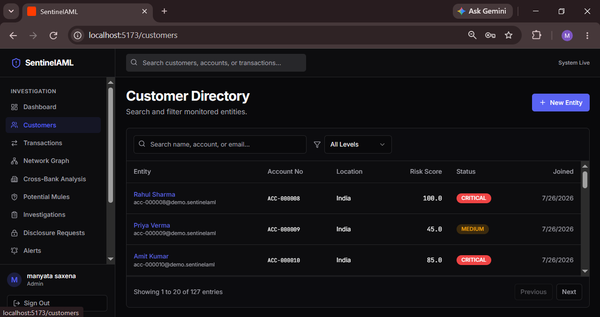
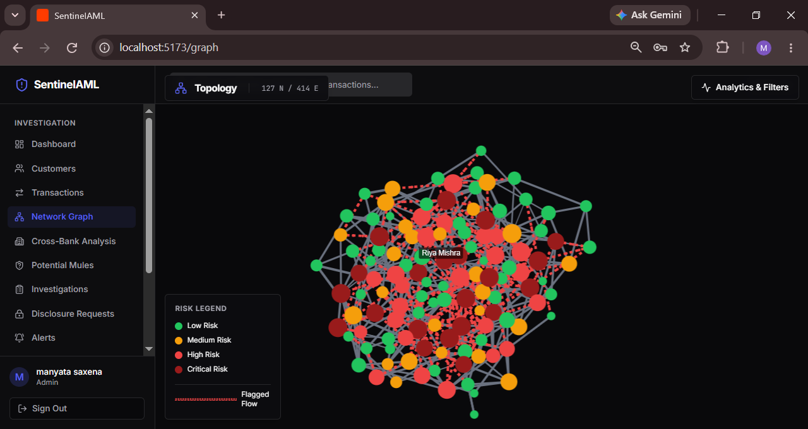

# 🛡️ SentinelAML: Anti-Money Laundering Intelligence Platform
                                     
> A full-stack AML investigation platform combining transaction monitoring, graph-based network analysis, intelligent risk scoring, potential mule detection, privacy-aware cross-bank analysis, and event-driven processing.

---


> A full-stack AML investigation platform that combines transaction monitoring, graph-based network analysis, explainable risk scoring, mule account detection, privacy-aware cross-bank analysis, and event-driven processing.

---

## 📑 Table of Contents

- [Overview](#-overview)
- [Problem Statement](#-problem-statement)
- [Key Features](#-key-features)
- [System Architecture](#-system-architecture)
- [Transaction Processing Flow](#-transaction-processing-flow)
- [Application Modules](#-application-modules)
- [Tech Stack](#-tech-stack)
- [Demo Data Snapshot](#-demo-data-snapshot)
- [Getting Started](#-getting-started)
- [Application Preview](#-application-preview)
- [Design Highlights](#-design-highlights)
- [Future Enhancements](#-future-enhancements)
- [Author](#-author)

---

## 🚀 Overview

**SentinelAML** helps compliance teams **detect, analyze, investigate, and prioritize suspicious financial activity**.

Instead of treating transactions as isolated records, SentinelAML models money movement as a **connected transaction network**. This lets investigators see not only *what* happened, but also *how* accounts are connected.

| Capability | Description |
|---|---|
| 🔍 Transaction Monitoring | Search, filter, and review transaction activity |
| 🧠 AML Rule Engine | Detects circular flows, fan-in, fan-out, structuring, and more |
| 🕸️ Network Graph | Interactive directed graph of account relationships |
| ⚡ Risk Scoring | Multi-factor scoring: LOW / MEDIUM / HIGH / CRITICAL |
| 🕵️ Mule Detection | Explainable, rule-based potential mule screening |
| 🏦 Cross-Bank Analysis | Privacy-aware analysis across 3 simulated banks |
| ⚙️ Event-Driven Processing | Kafka + workers + retries + Dead-Letter Queue |
| 👥 RBAC & Audit Logs | Role-based access with audit trail |

---

## 🎯 Problem Statement

Transactions can look normal in isolation but reveal suspicious behavior when viewed as part of a larger network.



This **circular flow** is a classic layering pattern. SentinelAML combines **transaction-level rules** with **network-level intelligence** to surface exactly these patterns.

---

## ✨ Key Features

### 🔍 Transaction Monitoring
Track sender, receiver, amount, currency, timestamp, status, and risk indicators, with search and filtering.

### 🧠 AML Rule Engine
Configurable rules detect:
- Circular transaction chains
- Fan-in aggregation
- Fan-out distribution
- High-value transactions
- High-frequency activity
- Structuring-related activity
- Suspicious network relationships

### 🕸️ Interactive Network Graph
Transactions are represented as a directed graph. Investigators can spot high-risk accounts, connected entities, circular relationships, and flagged transaction paths.

| Risk Level | Meaning |
|---|---|
| 🟢 Low | Normal activity |
| 🟠 Medium | Worth monitoring |
| 🔴 High | Needs review |
| 🔴 Critical | Highest priority |

### ⚡ Multi-Factor Risk Scoring
Risk is computed from transaction amount, frequency, connected accounts, circular behavior, fan-in/fan-out activity, suspicious indicators, and network relationships.

### 🕵️ Potential Mule Account Detection
An **explainable** rule-based system that evaluates:
- High fan-in and fan-out
- Rapid pass-through activity
- Received-to-transferred fund ratios
- Cross-bank activity
- Transaction velocity

Every mule score comes with the **reasons behind it**, so results are transparent.

### 🏦 Privacy-Aware Cross-Bank Analysis
Analysis across three simulated financial institutions using:
- Pseudonymous identifiers for external entities
- Restricted identity representation
- Cross-bank flow analysis
- Controlled identity disclosure workflows

### ⚙️ Event-Driven Processing
Kafka-based ingestion with background AML workers, retry mechanisms, a Dead-Letter Queue, worker health monitoring, and idempotent processing.

### 🔄 Retry & Dead-Letter Queue



### ⚡ Redis Caching
Cache-aside strategy, TTL-based caching, cache invalidation, worker heartbeat tracking, and graceful fallback if Redis is unavailable.

### 🔐 Authentication & RBAC
Roles: **Admin**, **Compliance Officer**, **Analyst**, **Investigator**. Includes password hashing, protected APIs, role-based permissions, and audit logging.

### 🚨 Alerts & Investigations
Centralized alerts with severity, account risk, detection reasons, and network connections.



### 📊 Compliance Reports & 📝 Audit Logs
Highest-risk entities, risk distribution, suspicious activity summaries, data exports, and a full trail of user and system actions.

---

## 🏗️ System Architecture



---

## 🔄 Transaction Processing Flow



Ingestion is separated from downstream processing, which gives a solid foundation for scalable AML workloads.

---

## 🖥️ Application Modules

| Module | Purpose |
|---|---|
| 📊 Dashboard | Overview of customers, transaction flow, high-risk nodes, open alerts |
| 👥 Customers | Search and filter entities by account, name, email, risk |
| 💸 Transactions | Monitor sender, receiver, amount, currency, timestamp, status |
| 🕸️ Network Graph | Visually explore relationships and suspicious patterns |
| 🏦 Cross-Bank Analysis | Privacy-aware analysis across institutions |
| 🕵️ Potential Mules | Explainable mule screening |
| 🔎 Investigations | Deep-dive into suspicious accounts and networks |
| 🚨 Alerts | Centralized detection and review |
| 📄 Compliance Reports | Risk summaries and exports |
| 📋 Audit Logs | Track system and investigation activity |
| ⚙️ Settings | System configuration and preferences |

---

## 🛠️ Tech Stack

| Layer | Technologies |
|---|---|
| **Frontend** | React, TypeScript, Vite, Tailwind CSS, Framer Motion, React Query, React Router, Lucide React, React Force Graph, D3.js |
| **Backend** | Node.js, Express.js, TypeScript, REST APIs, OpenAPI, Zod |
| **Database** | PostgreSQL, Drizzle ORM |
| **Event-Driven** | Apache Kafka, KafkaJS, Redis, ioredis, background workers, retry processing, Dead-Letter Queue |
| **Security** | Authentication, RBAC, password hashing, protected APIs, audit logging |
| **DevOps** | Docker, Docker Compose, Git, GitHub |

---

## 📈 Demo Data Snapshot

| Metric | Value |
|---|---|
| Customer Profiles | 127 |
| Transactions | 414 |
| High-Risk Nodes | 45 |
| Open Alerts | 180 |
| Simulated Banks | 3 |
| Cross-Bank Accounts | 121 |
| Cross-Bank Flows | 284 |
| Potential Mule Profiles | 19 |

---

## 🚀 Getting Started

### Prerequisites

- Node.js 20+
- pnpm
- PostgreSQL
- Redis and Kafka (or use Docker Compose)

### 1. Clone the repository

```bash
git clone https://github.com/manyataasaxena/Sentinel-AML-Network-Graph.git
cd Sentinel-AML-Network-Graph
```

### 2. Install dependencies

```bash
pnpm install
```

### 3. Configure environment variables

Create a `.env` file with:

```env
DATABASE_URL=your_postgresql_connection_string
REDIS_URL=your_redis_connection_string
KAFKA_BROKERS=your_kafka_broker
```

### 4. Start the development environment

```bash
pnpm dev
```

### 5. Or run everything with Docker

```bash
docker compose up --build
```

---

## 📸 Application Preview


| Dashboard | Transactions |
|---|---|
| 



 | 




| Network Graph | Cross-Bank Analysis |
|---|---|
| 




| Potential Mules | Compliance Reports |
|---|---|
| 


 


---

## 🎯 Design Highlights

- **Network-centric AML:** analyzes relationships between entities, not just individual transactions.
- **Explainable risk analysis:** every risk score and mule flag shows its contributing factors.
- **Privacy-aware intelligence:** cross-bank investigation using pseudonymous external entities.
- **Fault-tolerant processing:** Kafka, retries, Dead-Letter Queue, idempotency, and Redis fallback.
- **Investigator-first UI:** dedicated workflows for alerts, investigations, network analysis, and reporting.
- **Modular and scalable:** separate rule, graph, and risk engines with asynchronous processing.

---

## 🔮 Future Enhancements

- Machine learning anomaly detection
- Advanced behavioral profiling
- Graph embeddings and community detection
- Centrality and influence analysis
- Explainable AI (SHAP)
- AI-assisted investigations and automated summaries
- Real-time intelligence pipelines

---

## 👩‍💻 Author

**Manyata Saxena**
B.Tech, Computer Science Engineering

🔗 GitHub: [@manyataasaxena](https://github.com/manyataasaxena)
